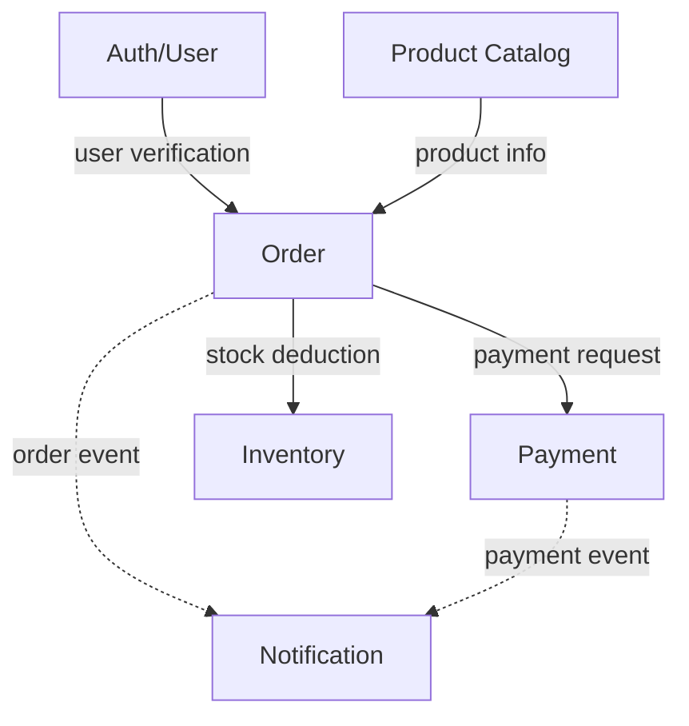
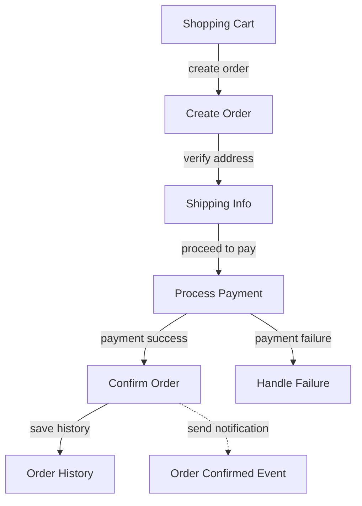
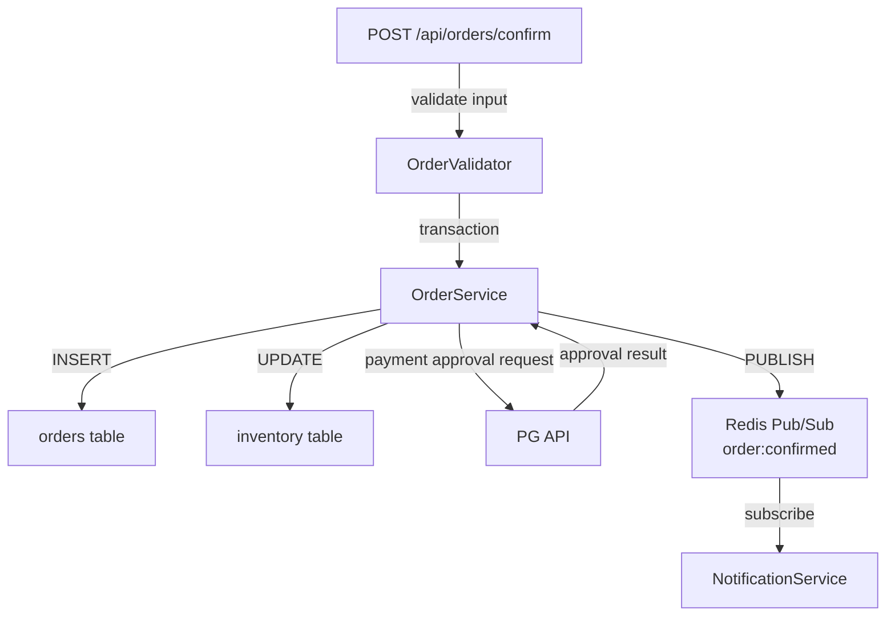

## Introduction
Since the release of Claude Opus 4.6, my reliance on LLMs has grown dramatically across every personal project. Some projects are now 100% LLM-coded. The broader trend seems to be shifting away from traditional hand-coding toward LLM-assisted — or even LLM-dependent — development.  
**Vibe coding** isn't anything fancy — it simply means **coding in natural language, stream-of-consciousness style, with the help of an LLM**. Thanks to that low barrier to entry, blog posts from non-developers sharing their vibe coding experiences pop up practically every day.  
As a result, a variety of approaches have emerged for people who code with LLMs. From the traditionally important TDD and SDD, to DDD resurfacing once again, to pre-prompt techniques like CLAUDE.md — all are solid methods for **keeping a project stable over the long haul**.  
Yet once you try to follow all of these at once, something creeps in. The project seems to be heading in the right direction, but somehow you feel exhausted.  
I felt it early on, as I'm sure many others have. With LLM assistance, churning out 20–30 commits a day is effortless, but keeping track of all those auto-generated work reports and code changes is overwhelming. On lower-priority projects, reports keep being produced because of the prompt setup — and I don't even read them.  
While searching for a solution to this problem, I arrived at the idea behind this post's title — **Graph Driven Development** — and I'd like to share it.

<br/>

## The Problem with the Status Quo
The existing approaches come with the following pain points:  
1. **Stress and fatigue** from the sheer volume of generated documents and the compulsion to read every single one  
2. **Lack of understanding** — even after reading all the documents, you still can't grasp the project as a whole  
3. When trying to write a natural-language prompt for the LLM, you realize you don't actually know what to implement or how to phrase it  

I tried various workarounds to address this. Condensing documents to just the essentials. Constantly reminding myself why I started the project. At one extreme, ignoring all progress updates entirely and looking only at the end result. As you might expect, none of these were good strategies for sustaining a project long-term, and they left me feeling a deep sense of frustration. The core problem remained stubbornly unsolved.

### Text Is Hard to Take In
Depending on the prompt and the scope of work, the work reports that the LLM hands back are well-written. The formatting follows whatever template you set. But a single document easily exceeds 200 lines. For larger tasks, 400–500 lines is common.  
And the volume of documents is something else entirely. Without automation, you're constantly organizing the flood of documents, keeping everything up to date, and issuing new instructions to the LLM. Sometimes it feels less like the LLM is helping me and more like I'm helping the LLM do its job well.  
Above all, text is linear. One of the biggest problems in vibe coding, I believe, is this: **"I have no idea where this code sits within the whole system."** I didn't write the code, so of course I don't know.  
Software is fundamentally a structure of interconnected features — yet when you describe it in long-form text, the structure fades. So what if we expressed it as a graph instead?

<br/>

## Graphs
<div style="display: flex; gap: 10px; align-items: flex-start;">
  <figure style="flex: 1; margin: 0;">
    
    <figcaption style="text-align: center; color: gray;">Traditional documents</figcaption>
  </figure>
  <figure style="flex: 1; margin: 0;">
    
    <figcaption style="text-align: center; color: gray;">A project relationship graph (by Mermaid)</figcaption>
  </figure>
</div>
<br/>

As the images illustrate, expressing a project as a graph makes it visible at a glance. Connecting features to features, modules to modules, and domains to domains through nodes — then managing the project and instructing the LLM based on that graph — is the core idea behind GDD.

<br/>

## Core Concept: Hierarchical Graphs

### Why Layers, Not a Single Graph?
If you cram everything into one graph, it becomes unreadable at just 30–50 nodes. The example image above already looks complex.  
Organizing into layers means managing the same system as **separate graph files for each layer**.

### Layer 0 — Domain Graph
Shows only what major chunks (domains) exist in the system and how they connect. This graph is well-suited for asking an AI to understand the overall structure, or for sharing with non-developer roles (planning, design, key decision-makers, etc.).



### Layer 1 — Feature Graph
A closer look inside a single domain. Handed off to the team members working on that domain.



### Layer 2 — Implementation Graph
Zooms into a single feature to show the actual API endpoints, classes, and database tables. This is the file you give the LLM when you say "write the order confirmation API."



**Each node at a given layer corresponds to one graph file at the layer below.**

```
L0-system.mermaid
  └─ Order node → L1-order.mermaid
                    └─ Confirm node → L2-order-confirm.mermaid
```

### Key Principles of the Hierarchy
- Each graph file stays small at 5–10 nodes, making it easy to grasp at a glance
- You can instruct the LLM with just "L0 + relevant L1 + target L2"
- Adding new features is natural — add a node at the appropriate layer and create a child file

<br/>

## GDD Framework Proposal
Applying the core concept of hierarchical graphs to a real project requires principles and structure. <span style="color: gray;">(It's almost embarrassing to call it mature — this is very much an early-stage design.)</span> Here is the initial design of the GDD Framework.

### Core Principles
**Graph as Truth** — If it's not in the graph, it doesn't exist. Every feature, dependency, and decision is reflected in the graph.  
**Zoom In / Zoom Out** — A single system is split into multiple layers, maintaining the appropriate level of detail at each layer.  
**Node = Context Boundary** — Each node is a unit of context that an AI or developer can handle at once.  
**Edge = Dependency Contract** — Edges between nodes aren't just arrows — they're interface contracts.  
**Graph First, Code Second** — Don't write code first. Add the node to the graph, then write the code.  

### Directory Structure

```
my-project/
├── graph/
│   ├── L0-system.mermaid              # System-wide overview
│   ├── L0-system.meta.yaml            # L0 node metadata
│   │
│   ├── auth/                          # Per-domain subdirectory
│   │   ├── L1-auth.mermaid
│   │   ├── L1-auth.meta.yaml
│   │   └── decisions/
│   │       └── DEC-auth-001.yaml
│   │
│   ├── order/
│   │   ├── L1-order.mermaid
│   │   ├── L1-order.meta.yaml
│   │   ├── L2-order-confirm.mermaid
│   │   ├── L2-order-confirm.meta.yaml
│   │   └── decisions/
│   │       ├── DEC-order-001.yaml
│   │       └── DEC-order-002.yaml
│   │
│   └── payment/
│       ├── L1-payment.mermaid
│       └── L1-payment.meta.yaml
│
├── src/
├── .gdd.yaml                          # GDD configuration
└── gdd-lock.yaml                      # Auto-generated consistency snapshot
```

Two design decisions are at the heart of this structure.  
First, **graph files and meta files exist as 1:1 pairs.** Each `.mermaid` file is accompanied by a `.meta.yaml` file with the same name in the same directory. The meta file supplements what Mermaid alone cannot express — detailed per-node information such as owner, status, API specs, and source file paths. Examples follow.

**L0 Meta File Example** — `graph/L0-system.meta.yaml`:
```yaml
graph: L0-system.mermaid
level: 0
description: "E-commerce platform system overview"
last_updated: 2026-03-05

nodes:
  Order:
    child_graph: order/L1-order.mermaid
    owner: "@devman-kr"
    status: active
    description: "End-to-end order flow from creation to confirmation"
    tech_stack: ["C#", "ASP.NET Core", "PostgreSQL", "Redis"]

  Auth:
    child_graph: auth/L1-auth.mermaid
    owner: "@devman-kr"
    status: active
    description: "JWT-based user authentication and membership"
    tech_stack: ["C#", "ASP.NET Core Identity", "Redis"]

  Payment:
    child_graph: payment/L1-payment.mermaid
    owner: "@devman-kr"
    status: active
    description: "Payment processing via PG integration"
    tech_stack: ["C#", "ASP.NET Core", "PostgreSQL"]

  Catalog:
    child_graph: catalog/L1-catalog.mermaid
    owner: "@devman-kr"
    status: planned
    description: "Product registration, categories, and search"

edges:
  - from: Order
    to: Auth
    type: requires
    contract: "Identify user via JWT token"
  - from: Order
    to: Payment
    type: requires
    contract: "Payment approval request API"
  - from: Order
    to: Inventory
    type: requires
    contract: "Stock deduction API"
  - from: Order
    to: Notification
    type: event
    contract: "Publish order:confirmed event"
```

**L1 Meta File Example** — `graph/order/L1-order.meta.yaml`:
```yaml
graph: L1-order.mermaid
level: 1
parent_node: Order
parent_graph: ../L0-system.mermaid
description: "Internal feature flow of the Order domain"
last_updated: 2026-03-05

nodes:
  Confirm:
    child_graph: L2-order-confirm.mermaid
    owner: "@devman-kr"
    status: active
    description: "Finalize order after payment completion"
    api:
      method: POST
      path: /api/orders/confirm
      request: "{orderId, paymentToken}"
      response: "{orderId, status, confirmedAt}"

  OrderCreate:
    child_graph: L2-order-create.mermaid
    owner: "@devman-kr"
    status: active
    description: "Create a new order from the shopping cart"

edges:
  - from: Cart
    to: OrderCreate
    label: "create order"
  - from: Confirm
    to: History
    type: requires
    contract: "Return orderId after order history is saved"
```

**L2 Meta File Example** — `graph/order/L2-order-confirm.meta.yaml`:
```yaml
graph: L2-order-confirm.mermaid
level: 2
parent_node: Confirm
parent_graph: L1-order.mermaid
description: "Implementation details of order confirmation"
last_updated: 2026-03-05

nodes:
  OrderValidator:
    owner: "@devman-kr"
    status: active
    source_file: "src/Order/Validators/OrderValidator.cs"
    description: "Validate inputs and business rules before order confirmation"
    validations:
      - "Verify order status is 'awaiting payment'"
      - "Verify requesting user is the order owner"
      - "Verify sufficient stock is available"

  OrderService:
    owner: "@devman-kr"
    status: active
    source_file: "src/Order/Services/OrderService.cs"
    description: "Execute order confirmation transaction"

decisions:
  - ref: DEC-order-001
  - ref: DEC-order-002
```
Second, **domains are separated into their own directories.** Even with 10 domains, each directory contains only 3–6 files. Decision records (DEC files) are also distributed across per-domain `decisions/` folders.

**Example** — `graph/order/decisions/DEC-order-001.yaml`:
```yaml
id: DEC-order-001
title: "Stock deduction strategy on order confirmation"
date: 2026-03-01
status: accepted
related_nodes:
  - graph: L2-order-confirm.mermaid
    node: OrderService

context: |
  For popular products, multiple users may place orders for the same item simultaneously.
  A trade-off exists between inventory consistency and order processing speed.

options:
  - name: "Optimistic Concurrency (EF Core xmin column)"
    pros: ["High throughput", "No lock waiting", "Native Npgsql support"]
    cons: ["Must handle DbUpdateConcurrencyException", "Complex retry logic"]
  - name: "Pessimistic Locking (SELECT FOR UPDATE)"
    pros: ["Guaranteed collision prevention", "Simple implementation"]
    cons: ["Lock wait overhead", "Deadlock risk"]

decision: "Pessimistic Locking (SELECT FOR UPDATE)"
reason: "High collision frequency for popular products; inventory consistency is top priority"

consequences:
  - "Transaction timeout required (CommandTimeout = 3s)"
  - "Deadlock detection and Polly-based automatic retry (max 3 attempts)"
  - "Immediate user notification on insufficient stock"
```

<br/>

## AI Context Supply Strategy
How this structure is used when collaborating with AI is the core value of GDD.

| Task Type           | Files to Provide to the AI            |
|---------------------|---------------------------------------|
| Understand overall structure | L0 graph + L0 meta            |
| Design a feature    | L0 + relevant L1 + L1 meta           |
| Implement code      | L0 + L1 + L2 + L2 meta + related DEC |
| Fix a bug           | Target L2 + connected L2s + meta     |
| Add a new domain    | L0 + L0 meta + related DEC           |

You simply pick the appropriate layer's files based on the scope of the task. This lets you use the AI's context window efficiently while ensuring the AI always knows where the current piece fits within the whole system.

<br/>

## What GDD Aims to Solve

To summarize everything so far, here are the problems GDD seeks to address:  
> **The AI doesn't know the overall structure** — Deliver it at a glance with the L0 graph.  
**The AI forgets the beginning of long documents** — Provide only the necessary context through layer-level separation.  
**"If I change this, what breaks?"** — Edges immediately reveal the scope of impact.  
**No one knows why it was implemented this way** — The `decisions/` folder preserves per-node decision history.  
**Vibe coding leads to spaghetti code** — The Graph First principle and enforced synchronization maintain structure.  

<br/>

## Closing Thoughts
This post covered why GDD is needed, what its core concept of hierarchical graphs is, and the basic structure of the framework.  
But honestly, this is still just an idea at this point. Applying it to real projects will undoubtedly surface various problems — metadata files growing unwieldy, synchronization errors between graphs and actual code, and likely many others. Also, while I used the grand term "Development" (as in methodology), it's really closer to a Design/Architecture approach in practice.  
Nevertheless, I've grown quite attached to this methodology, and I think it's a genuinely decent idea. My plan going forward is to apply it to a personal project to prove its effectiveness, and to increase its stability through various supporting methods.

<br/>

---

>**Inspirations**  
**C4 Model** — An approach to decomposing software architecture into four levels — Context, Container, Component, and Code — and visualizing them as diagrams.  
**Architecture Decision Records** — Documents that capture important technical decisions made during software design, along with their context and rationale.  
**Graph Oriented Programming** — An approach that uses graph structures to express complex relationships and flows of data and logic.  
These approaches provided significant inspiration in establishing the core concepts.
